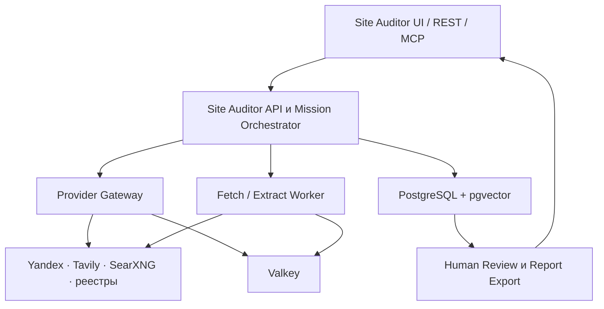
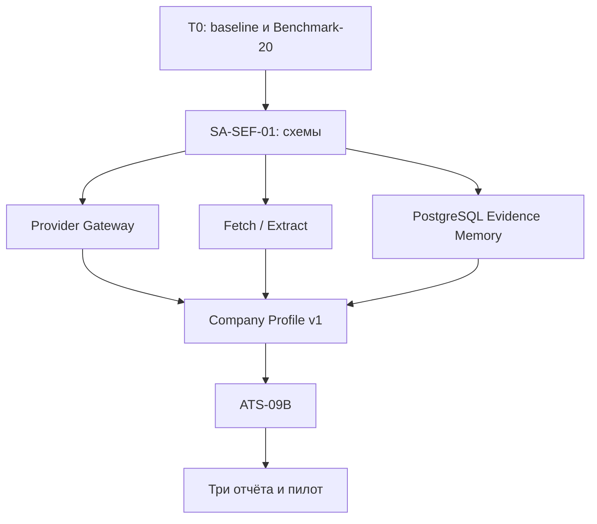

# AIMETON Search & Evidence Fabric

## Тактический план доработки инфраструктуры и AIMETON Site Auditor

**Статус:** рабочий план P0–P1  
**Дата среза:** 28 июля 2026  
**Горизонт:** 30 дней с продолжением до 90 дней  
**Главная цель:** получить повторяемый продаваемый доказательный профиль компании, не разрушив уже созданные контуры безопасности, развёртывания и внешней приёмки.

---

## 1. Итоговое тактическое решение

На ближайшие 30 дней AIMETON не должен создавать новый отдельный «универсальный поисковик» и не должен преждевременно дробить систему на множество микросервисов.

Нужно развивать существующий Site Auditor как первый коммерческий орган AIMETON, а внутри него выделить заменяемые контракты Search & Evidence Fabric:

1. `Mission Contract`;
2. `Provider Gateway`;
3. `Document Fetch/Extract`;
4. `Entity Resolution`;
5. `Claim & Evidence Ledger`;
6. `Company Profile v1`;
7. `Cost Ledger`;
8. `Human Approval`;
9. `Report Export`.

Инфраструктура должна обеспечить этим контрактам PostgreSQL/pgvector, постоянные тома, резервное копирование, отдельный тяжёлый worker для браузерного извлечения, безопасные миграции и доказуемый deploy/rollback.

**Главный порядок:**

```text
зафиксировать стабильный baseline
→ определить схемы миссии и доказательств
→ подключить заменяемый поиск
→ загружать и проверять первичные документы
→ собирать доказательный профиль
→ прогнать Benchmark-20
→ выпустить три продаваемых отчёта
→ автоматизировать batch-охоту и карту поставщиков
→ включить мониторинг и подписную модель
```

---

## 2. Фактическая исходная точка

### Уже создано и должно быть сохранено

- Site Auditor `main` находится на линии версии `0.8.0`.
- Последний зафиксированный основной commit сервиса: `cdcf9adfddce84a57c989a26002b21372ab76e95`.
- Есть транзакционный stage-deploy с exact SHA, health check, smoke test, rollback и retention.
- Разделены публичный и административный MCP endpoints.
- Реализованы rate limiting, concurrency limits, SSRF/DNS-rebinding protection и санитарно очищенный audit trail.
- Есть Runtime Core v0.1 с task, actor, mandate, commitment, event, evidence, tool execution, plan step и correlation ID.
- Есть независимый Test Sentinel и zero-touch цикл эфемерного VPS с teardown/no-orphan.
- ATS-09A уже дошёл до успешной live-проверки и корректной упаковки evidence; дальнейшая разработка должна использовать этот контур, а не создавать новый испытательный механизм.

### Текущие разрывы относительно стратегии

| Область | Сейчас | Требуется для P0 |
|---|---|---|
| Discovery | Только self-hosted SearXNG | Yandex Search API как основной РФ-провайдер, Tavily fallback, SearXNG резерв |
| Provider contract | Вызов SearXNG встроен в `external_sources.py` | Единый Gateway, адаптеры, квоты, retries, circuit breaker, cost events |
| Извлечение | `httpx + BeautifulSoup`, затем Playwright для сайта | Отдельный pipeline загрузки каждого ценного внешнего документа; Crawl4AI-адаптер |
| Доказательства | В evidence повышается в основном официальный сайт; прочее остаётся сниппетом | Claim → Evidence с цитатой/локатором, датой, digest, уровнем доверия и правами |
| Память | Runtime Core на SQLite | PostgreSQL/pgvector для SEF; Runtime переводится на PostgreSQL после проверки store contract |
| Кэш/состояние провайдера | Valkey развёрнут, но не является системным SEF-контуром | Кэш поиска/документов, rate state, circuit state, idempotency |
| Профиль компании | Поля и KM-модель есть в LLM-схеме, но внешние факты в основном не подтверждены документами | Контакты, численность, финансы, владельцы, связи, суды и банкротства как проверяемые claims |
| Экономика | Нет полного учёта себестоимости миссии | Стоимость запроса, документа, LLM, браузерных минут, ручной проверки и отчёта |
| Отчёт | Клиентский PDF формируется в UI | Версионируемый серверный отчёт с evidence appendix и статусом ручного утверждения |
| Приёмка | ATS-09A проверяет stage/MCP/security | ATS-09B проверяет содержательную полноту, ATS-09C деградацию, ATS-09D сохранность evidence |
| Stage stack | Рабочий compose находится как серверный deploy-артефакт | Канонический обезличенный stack manifest и migration/backup contract в infrastructure repo |

### Управленческий долг

- Issue Site Auditor `#40` описывает Runtime Core v0.1, хотя реализация уже merged через PR `#49`; issue надо обновить или закрыть по фактическому DoD.
- Issue Site Auditor `#36` содержит этапы SA-03, значительная часть которых уже merged и live-проверена; статус нужно привести к фактам.
- Issue Sentinel `#15` ATS-09A остаётся открытым, хотя GitHub evidence уже подтверждает успешный live-run; после сверки артефакта его следует закрыть.
- ATS-09B/09C/09D остаются правильным следующим испытательным контуром и должны быть привязаны к SEF-P0.

---

## 3. Целевая P0-топология



### Границы компонентов

- **Site Auditor** отвечает за коммерческую миссию, профиль компании, KM-интерпретацию, AI-возможности и отчёт.
- **SEF contracts** отвечают за поиск, загрузку, извлечение, сущности, claims, evidence, качество и стоимость.
- **Runtime Core** хранит состояние задачи, мандат и трассу исполнения, но не бизнес-логику поиска.
- **PostgreSQL** является системой записи для миссий, сущностей, claims, evidence и cost events.
- **Valkey** используется как кэш и краткоживущее состояние, но не как единственное постоянное хранилище.
- **Browser/Crawl worker** работает отдельно от API-контейнера и получает ограниченный egress, concurrency и TTL.
- **Sentinel** проверяет систему снаружи и уничтожается после кампании.

---

## 4. План на 30 дней

## Этап T0 — 1–2 дня: зафиксировать базу и расчистить управление

### Цель

Начать SEF-разработку от доказанного baseline, не смешивая старые эксплуатационные долги с новыми функциями.

### Работы

1. Зафиксировать в GitHub Project инициативу `SEF-P0 — Revenue Evidence Core`.
2. Связать с ней три репозитория:
   - `AIMETON_site_auditor`;
   - `aimeton-infrastructure`;
   - `aimeton-test-sentinel`.
3. Проверить и зафиксировать:
   - commit сервиса;
   - фактический deployment SHA;
   - успешный ATS-09A evidence bundle;
   - состояние teardown/no-orphan.
4. Обновить/закрыть устаревшие issues `SA-03`, `SA-03.4` и `ATS-09A` только по evidence.
5. Создать Benchmark-20: 20 компаний, 4 отрасли, разные размеры и качество цифрового следа.
6. Для первых пяти компаний вручную сформировать эталонные обязательные факты и источники.

### Выходной шлюз

- baseline связан с точными SHA;
- старые issues не изображают незавершённость уже выполненных работ;
- Benchmark-20 имеет версию, владельца и критерии изменения;
- новая разработка не начинается до зелёного baseline CI.

---

## Этап T1 — дни 2–5: SEF-01 Mission Contract и Evidence Schema

### Цель

Сделать доказательность частью модели данных, а не текстовым соглашением внутри prompt.

### Сущности P0

| Сущность | Назначение |
|---|---|
| `mission` | Заказ на анализ, ограничения, бюджет, срок, профиль результата |
| `entity` | Компания, лицо, домен, документ или событие |
| `entity_identifier` | ИНН, ОГРН, домен, телефон, email и другие идентификаторы |
| `claim` | Нормализованное утверждение о сущности |
| `evidence` | Проверяемое основание claim |
| `source` | Провайдер/реестр/сайт и условия использования |
| `document` | Загруженный первичный документ и его digest |
| `provider_call` | Факт обращения к провайдеру, latency, статус и quota |
| `cost_event` | Денежная или вычислительная стоимость операции |
| `review_decision` | Решение человека: accept/reject/request_check |
| `report` | Версия клиентского результата и состав доказательств |

### Обязательные поля evidence

```text
evidence_id
claim_id
source_id
document_id
source_url
canonical_url
title
publisher
published_at
accessed_at
quote
locator
content_digest
evidence_tier
confidence
verification_status
storage_rights
retention_until
pii_class
correlation_id
```

### Инварианты

- search result и snippet всегда создаются как `discovery_hint`, а не evidence;
- claim не получает статус `confirmed`, пока не связан хотя бы с одним допустимым evidence;
- критические claims не могут попасть в клиентский отчёт без источника;
- `not_found` является результатом выполненного плана поиска, а не пустым полем;
- противоречащие claims не затирают друг друга;
- LLM создаёт интерпретацию или candidate claim, но не является source;
- каждый вызов провайдера порождает telemetry и, если применимо, `cost_event`;
- схемы должны быть переносимыми и не зависеть от одного поискового API.

### Выходной шлюз

- JSON Schema и SQL migrations проходят тесты;
- существующий Runtime correlation ID проходит через mission, provider calls и evidence;
- есть фикстуры `hint → document → evidence → claim`;
- запрещённая цепочка `snippet → confirmed claim` падает в тесте.

---

## Этап T2 — дни 3–7: Provider Gateway и управляемый поиск

### Цель

Убрать SearXNG из центра бизнес-логики и получить заменяемый российский discovery.

### Единый контракт

```text
search(query, mission_context, budget, locale, source_classes)
→ SearchResponse
  - hits[]
  - provider_id
  - request_id
  - latency_ms
  - quota_used
  - estimated_cost
  - degradation_state
  - warnings[]
```

### Адаптеры и порядок

1. `yandex_search` — основной РФ discovery.
2. `tavily` — ограниченный fallback для международных и слабых выдач.
3. `searxng` — резервный изолированный адаптер и сравнительный канал.
4. `cache` — нулевой эшелон перед внешним вызовом.

### Обязательная логика

- timeout на каждый provider;
- ограниченные retries с backoff;
- circuit breaker;
- per-mission budget;
- глобальная квота;
- дедупликация URL;
- canonical URL;
- provider health без раскрытия секретов;
- reason code для fallback;
- сохранение provider call и cost event;
- запрет автоматического перехода на дорогой источник без mission policy.

### Выходной шлюз

- одинаковый контракт проходит для трёх адаптеров;
- отказ одного provider не останавливает миссию;
- degraded mode явно виден в API и отчёте;
- в Benchmark-5 измерены recall, latency и стоимость;
- API keys не попадают в logs, Runtime и evidence.

---

## Этап T3 — дни 4–9: Document Fetch/Extract

### Цель

Перейти от списка ссылок к загруженным и проверенным документам.

### Последовательность извлечения

1. Проверить URL, DNS и SSRF boundary.
2. Попытаться получить статический HTML текущим безопасным `httpx`-контуром.
3. Извлечь основной текст, метаданные, таблицы и ссылки.
4. Если документ динамический или структура потеряна — передать в Crawl4AI worker.
5. Playwright использовать только как ограниченный fallback.
6. Нормализовать текст.
7. Посчитать digest.
8. Сохранить document record.
9. Извлечь candidate claims.
10. Создать evidence только с цитатой/локатором.

### Инфраструктурные ограничения worker

- отдельный контейнер;
- CPU/RAM limits;
- concurrency P0 не более 2;
- max document size;
- max redirects;
- mission TTL;
- egress только в публичный интернет;
- запрет private/link-local/metadata IP;
- очередь сохраняет idempotency key;
- авария браузера не роняет API.

### Выходной шлюз

- минимум 80% разрешённых HTML-документов Benchmark-5 извлекаются без ручного копирования;
- каждый evidence имеет digest, accessed_at и quote/locator;
- browser fallback измеряется отдельно;
- повторная загрузка неизменившегося документа использует кэш.

---

## Этап T4 — дни 5–10: PostgreSQL/pgvector и Evidence Memory P0

### Цель

Сделать результаты миссий повторно используемым активом.

### Инфраструктура

1. Добавить PostgreSQL с pinned major/minor image.
2. Включить pgvector, но не строить сложный vector-first поиск.
3. Создать отдельные схемы:
   - `runtime`;
   - `sef`;
   - `reporting`.
4. Миграции выполнять до переключения приложения.
5. Для каждой миграции иметь forward test и backup/restore plan.
6. Настроить ежедневный `pg_dump`, шифрование, retention и еженедельный restore test.
7. Зафиксировать resource limits и disk thresholds.

### Порядок перехода

- сначала SEF пишет новые данные в PostgreSQL;
- Runtime Core остаётся на SQLite до прохождения PostgreSQL store contract tests;
- затем Runtime переключается на PostgreSQL отдельным изменением;
- SQLite backup сохраняется до подтверждённого restore и ATS persistence test.

### Выходной шлюз

- restart/redeploy не теряет миссии и evidence;
- backup создаётся автоматически;
- restore проверен в изолированную БД;
- миграция не выполняется из нескольких контейнеров одновременно;
- pgvector используется только для проверенного текста документов/claims, а не для сырых поисковых сниппетов.

---

## Этап T5 — дни 7–14: Company Profile v1 и первый продаваемый отчёт

### Цель

Получить три отчёта, которые можно показать и продать.

### Обязательные секции профиля

1. Идентичность компании.
2. Официальный сайт и домены.
3. Контакты.
4. Численность и кадровые сигналы.
5. Выручка, прибыль, активы, налоги с периодами.
6. Руководители и учредители.
7. Предполагаемые владельцы и аффилированность с явной маркировкой гипотез.
8. Судебные, арбитражные, исполнительные и банкротные события.
9. Закупки, вакансии, новости и отзывы.
10. Восстановленный профиль бизнес-машины AIMETON.
11. Экономические сигналы.
12. Одна главная AI-возможность и 3–10 прикладных решений.
13. Риски, пробелы и противоречия.
14. Приложение доказательств.

### Источники P0

- официальный сайт компании;
- Yandex Search API для discovery;
- SearXNG/Tavily как fallback;
- DaData free для нормализации и базовой идентификации;
- точечные официальные проверки;
- допустимые открытые документы;
- ручная premium-проверка только по отдельному решению.

### Human Approval

Перед выпуском отчёта оператор должен:

- подтвердить identity;
- проверить критические claims;
- разрешить или отклонить противоречия;
- проверить контакты;
- утвердить коммерческую возможность;
- зафиксировать продолжительность ручной работы;
- подписать версию отчёта.

### Выходной шлюз

- три демонстрационных отчёта из разных отраслей;
- 100% критических claims имеют evidence;
- не менее 80% обязательных полей заполнены или имеют доказанный `not_found`;
- обычный отчёт строится не более 15 минут;
- ручная проверка занимает не более 20 минут;
- переменные затраты не превышают 10% тестовой цены express-отчёта.

---

## Этап T6 — дни 10–18: ATS-09B и Benchmark-20

### Цель

Измерять не красоту ответа LLM, а полезность и доказательность результата.

### Метрики

| Контур | Метрика |
|---|---|
| Discovery | Recall@20, полезные домены, дубли, provider stability |
| Entity | точность INN/OGRN/domain/phone resolution |
| Claims | precision, completeness, contradiction rate |
| Evidence | доля critical claims с evidence, T1/T2 share |
| Extraction | document success rate, browser fallback rate |
| Время | p50/p95 mission duration, operator minutes |
| Стоимость | provider cost, LLM cost, browser minutes, cost/report |
| Коммерция | пригодность повода, качество ЛПР, готовность пилота |

### Классы результата

- `passed`;
- `failed`;
- `blocked`;
- `inconclusive`;
- `degraded`.

### Выходной шлюз

- Benchmark-20 полностью воспроизводим;
- ATS-09B выдаёт JSON, JUnit и Markdown;
- volatile facts проверяются по источнику и допустимому диапазону;
- результаты связаны с service SHA, schema version и provider registry version;
- ошибки содержания не маскируются HTTP 200.

---

## Этап T7 — дни 15–24: batch missions, региональная охота и карта поставщиков

### Цель

Превратить единичный отчёт в повторяемую платную фабрику.

### Работы

1. Добавить batch mission API.
2. Использовать PostgreSQL как надёжную очередь миссий с отдельным worker.
3. Valkey использовать для:
   - кэша;
   - rate limits;
   - provider circuit state;
   - краткоживущих locks.
4. Entity resolution по:
   - ИНН;
   - ОГРН;
   - домену;
   - телефону;
   - email domain;
   - нормализованному названию + региону.
5. Дедуплицировать компании до глубокого анализа.
6. Ограничивать deep audit top-N кандидатами.
7. Добавить экспорт CSV/XLSX и машиночитаемый JSON.
8. Зафиксировать отдельные mission profiles:
   - `company_passport`;
   - `regional_hunt`;
   - `supplier_map`.

### Выходной шлюз

- batch из 20 компаний переживает restart worker;
- повторная миссия переиспользует допустимое свежее evidence;
- глубокий анализ не запускается для дублей и низкоприоритетных кандидатов;
- стоимость и статус видны по каждой компании;
- оператор может скачать shortlist и evidence appendix.

---

## Этап T8 — дни 20–30: устойчивость, эксплуатация и коммерческий пилот

### Цель

Подготовить систему к первой оплачиваемой работе без создания преждевременного публичного SaaS.

### ATS-09C

Проверить:

- Yandex timeout/429;
- Tavily недоступен;
- SearXNG пуст/429;
- отдельный источник 403/timeout;
- Crawl worker упал;
- Valkey недоступен;
- PostgreSQL read-only/connection failure;
- RouterAI timeout/invalid JSON;
- oversized/malformed input;
- campaign TTL;
- обязательный teardown/no-orphan.

### ATS-09D

Проверить:

- JSON/JUnit/Markdown evidence;
- service SHA, Sentinel SHA и schema versions;
- digest и timestamps;
- cost summary;
- сохранение evidence до teardown;
- secret canary;
- retention последнего green и последнего failure;
- восстановление из backup.

### Коммерческий пилот

1. Не открывать самостоятельный публичный prod до ATS-09B/09C.
2. Первые заказы выполнять в режиме managed service:
   - оператор запускает миссию;
   - проверяет evidence;
   - утверждает отчёт;
   - передаёт PDF/XLSX клиенту.
3. Предложить:
   - express-профиль;
   - углублённый профиль;
   - региональную охоту;
   - карту поставщиков.
4. На каждом заказе измерять:
   - цену;
   - фактические затраты;
   - время;
   - число исправлений;
   - полезность для клиента;
   - повторный спрос.

### Выходной шлюз

- один оплаченный или подтверждённый пилот;
- валовая маржа измерена;
- нет критических секретов в evidence;
- система корректно маркирует degraded;
- определено, какой продукт масштабировать в P1.

---

## 5. Тактический backlog по репозиториям

## `AIMETON_site_auditor`

| ID | Приоритет | Задача | Зависимость | Definition of Done |
|---|---:|---|---|---|
| `SA-SEF-01` | P0 | Mission Contract + Evidence Schema | T0 | JSON Schema, migrations, fixtures, запрет snippet→fact |
| `SA-SEF-02` | P0 | Provider Gateway | SA-SEF-01 | Yandex/Tavily/SearXNG, telemetry, budget, fallback |
| `SA-SEF-03` | P0 | Document Fetch/Extract | SA-SEF-01 | document digest, quote/locator, Crawl4AI adapter |
| `SA-SEF-04` | P0 | Claim & Evidence Ledger | 01, 03 | conflicts, freshness, tiers, review status |
| `SA-SEF-05` | P0 | Company Profile v1 | 02–04 | шесть критических пробелов закрыты evidence |
| `SA-SEF-06` | P0 | Human Review + report v1 | 05 | signed report version + evidence appendix |
| `SA-SEF-07` | P1 | Entity resolution | 04 | INN/OGRN/domain/phone dedupe |
| `SA-SEF-08` | P1 | Batch missions | 05, 07 | restart-safe batch worker |
| `SA-SEF-09` | P1 | Supplier map/regional hunt profiles | 08 | top-N deep audit и export |
| `SA-SEF-10` | P1 | Monitoring mission | 04, 07 | freshness policies и change events |

## `aimeton-infrastructure`

| ID | Приоритет | Задача | Зависимость | Definition of Done |
|---|---:|---|---|---|
| `INFRA-SEF-01` | P0 | Канонический stage stack manifest | T0 | compose/config в repo, без secrets, pinned versions |
| `INFRA-SEF-02` | P0 | PostgreSQL/pgvector | 01 | volume, health, limits, migration gate |
| `INFRA-SEF-03` | P0 | Backup/restore | 02 | daily backup, retention, encrypted storage, restore test |
| `INFRA-SEF-04` | P0 | Crawl/browser worker isolation | 01 | отдельный container, egress/CPU/RAM/concurrency/TTL |
| `INFRA-SEF-05` | P0 | Deploy migrations and rollback | 02 | preflight, single migrator, rollback evidence |
| `INFRA-SEF-06` | P1 | Dependency observability | 02, 04 | sanitized readiness, latency, queue depth, disk |
| `INFRA-SEF-07` | P1 | Production admission profile | ATS-09B/C | отдельные domain/secrets/data/retention boundaries |

## `aimeton-test-sentinel`

| ID | Приоритет | Задача | Зависимость | Definition of Done |
|---|---:|---|---|---|
| `ATS-09B` | P0 | Economic Intelligence Acceptance | SA-SEF-05 | Benchmark-20, content/evidence/cost metrics |
| `ATS-09C` | P0 | Provider degradation | SA-SEF-02/03 | bounded retries, degraded status, no false facts |
| `ATS-09D` | P0 | Evidence/retention handback | INFRA-SEF-03 | evidence survives teardown and restore |
| `ATS-10` | P1 | Batch and idempotency campaign | SA-SEF-08 | restart, duplicate dispatch, partial completion |

---

## 6. Критический путь



**Нельзя начинать массовую охоту раньше, чем Company Profile v1 и Evidence Ledger проходят Benchmark-20.** Иначе система масштабирует не качество, а недостоверность и переменные расходы.

---

## 7. Финансовые шлюзы

| Решение | Когда разрешено |
|---|---|
| Yandex Search API | Сразу, с дневным и mission budget |
| Tavily paid | После исчерпания free/минимального лимита и измерения fallback value |
| DaData Extended | Когда Benchmark показывает провал численности/ОКВЭД, влияющий на продажу |
| DaData Max | Оплаченная выручка от профилей ≥ 60 000 ₽ или подписанный заказ |
| Контур.Фокус/аналог | Только как pass-through premium check |
| Яндекс Карты/2ГИС API | Только при отдельной экономике local organization search |
| Отдельный OpenSearch node | Только после p95/объёма, который PostgreSQL/pgvector не выдерживает |
| Browser cluster | Когда доля оплачиваемых миссий, требующих браузер, оправдывает постоянный кластер |
| Массовый ЕГРЮЛ/ЕГРИП loader | Только после юридической, тарифной и форматной проверки |

---

## 8. Общий Definition of Done для P0

P0 завершён только одновременно при выполнении всех условий:

- [ ] Benchmark-20 пройден на точных версиях схем и кода.
- [ ] 100% критических утверждений имеют проверяемый источник.
- [ ] Неподтверждённые выводы явно маркируются.
- [ ] Не менее 80% обязательных полей заполнены либо имеют доказанный `not_found`.
- [ ] Противоречия отображаются, а не затираются.
- [ ] Время обычного профиля ≤ 15 минут.
- [ ] Ручная проверка ≤ 20 минут.
- [ ] Переменные затраты express-отчёта ≤ 10% его тестовой цены.
- [ ] Restart/redeploy не теряет миссии и evidence.
- [ ] Backup восстановлен в тестовую БД.
- [ ] ATS-09B и ATS-09C зелёные.
- [ ] Evidence не содержит secrets.
- [ ] Есть три демонстрационных отчёта.
- [ ] Есть хотя бы один оплаченный или письменно подтверждённый пилот.

---

## 9. Что сознательно не делать в эти 30 дней

- не выделять каждый SEF-компонент в отдельный микросервис;
- не переносить Runtime Core в отдельный репозиторий до стабилизации контрактов;
- не строить OpenSearch;
- не строить Apache AGE/полный knowledge graph;
- не создавать массовый crawler;
- не загружать весь ЕГРЮЛ/ЕГРИП;
- не покупать дорогие географические API «для полноты»;
- не строить публичный self-service SaaS до прохождения содержательной и resilience-приёмки;
- не переносить всю бизнес-логику в LLM prompt;
- не считать search snippet доказательством;
- не смешивать stage и клиентские production-данные;
- не перестраивать работающий Sentinel.

---

## 10. Порядок первых десяти действий

1. Зафиксировать Initiative/Epics и актуализировать старые issues.
2. Заморозить Benchmark-20 v0.1.
3. Создать `SA-SEF-01` и утвердить схемы.
4. Занести обезличенный stage compose в `aimeton-infrastructure`.
5. Добавить PostgreSQL/pgvector и backup contract.
6. Реализовать Provider Gateway с существующим SearXNG-адаптером.
7. Добавить Yandex и Tavily без изменения прикладного API.
8. Реализовать document fetch/extract и promotion gate.
9. Собрать Company Profile v1 и три отчёта.
10. Запустить ATS-09B; только после него переходить к batch hunt.

---

## 11. Решение о первом инкременте

Первый рабочий инкремент должен объединить только четыре изменения:

```text
SA-SEF-01 Mission/Evidence Schema
+ SA-SEF-02 Provider Gateway
+ INFRA-SEF-01 canonical stage stack
+ INFRA-SEF-02 PostgreSQL/pgvector baseline
```

Он ещё не обязан выдавать идеальный отчёт. Его задача — создать правильную несущую конструкцию, на которую без повторной перестройки ставятся extraction, Company Profile и коммерческие продукты.

Следующий инкремент:

```text
Document Fetch/Extract
+ Claim & Evidence Ledger
+ Company Profile v1
+ ATS-09B Benchmark-20
```

Именно второй инкремент должен завершиться тремя демонстрационными отчётами и переходом к первому платному пилоту.

